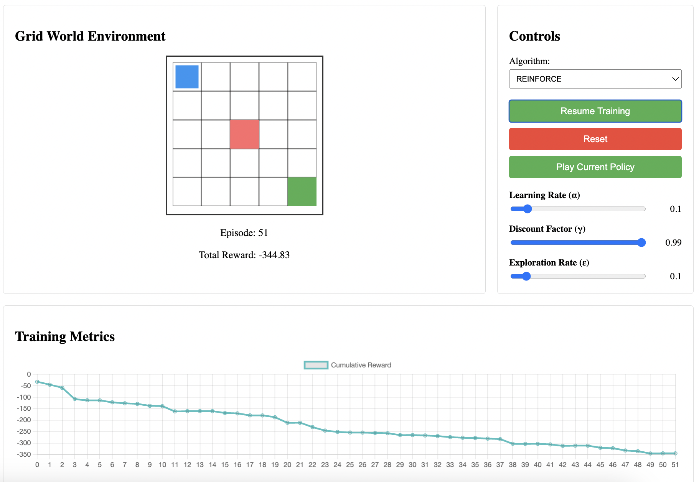

# RL Algorithm Visualization

An interactive web application for visualizing and comparing different reinforcement learning algorithms in a grid world environment.

## Features

- Interactive grid world environment with:
  - Goal state (green)
  - Penalty state (red)
  - Agent (blue)
- Multiple RL algorithm implementations:
  - Q-Learning
  - DQN (Deep Q-Network)
  - REINFORCE (Policy Gradient)
- Real-time visualization of learning process
- Cumulative reward tracking
- Customizable hyperparameters
- Policy visualization and playback

## Project Structure
