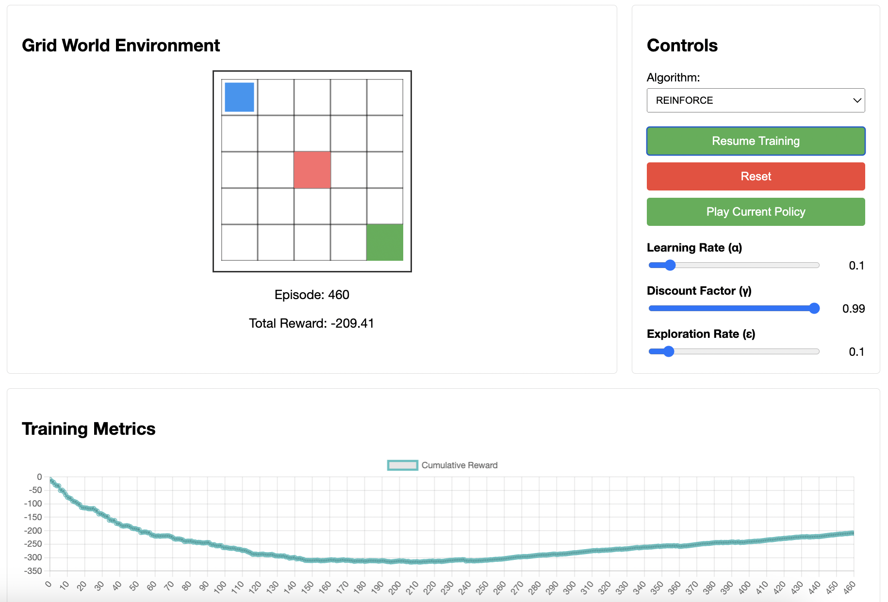

# RL Algorithm Visualization

An interactive web application for visualizing and comparing different reinforcement learning algorithms in a grid world environment.



## Features

- Interactive grid world environment with:
  - Goal state (green)
  - Penalty state (red)
  - Agent (blue)
- Multiple RL algorithm implementations:
  - Q-Learning
  - DQN (Deep Q-Network)
  - REINFORCE (Policy Gradient)
- Real-time visualization of learning process
- Cumulative reward tracking
- Customizable hyperparameters
- Policy visualization and playback

## Project Structure

## Installation Instructions

1. Clone the repository:
bash
git clone https://github.com/yourusername/rl-visualization.git
cd rl-visualization

2. Create and activate a virtual environment:

On Windows:

```bash
python -m venv venv
venv\Scripts\activate
```

On macOS/Linux:
```bash
python -m venv venv
source venv/bin/activate
```

3. Install the required packages:
```bash
pip install -r requirements.txt
```

## Running the Application

1. Make sure your virtual environment is activated
2. Start the Flask server:
```bash
python app.py
```
3. Open your web browser and navigate to:
```
http://localhost:5000
```

## Project Structure
```
rl-visualization/
├── backend/
│   ├── agents/         # RL algorithm implementations
│   ├── environment/    # Grid world environment
│   └── utils/          # Helper functions
├── frontend/
│   ├── static/         # CSS, JavaScript, and assets
│   └── templates/      # HTML templates
└── api/                # Flask API endpoints
```

## License

This project is licensed under the MIT License - see the [LICENSE](LICENSE) file for details.